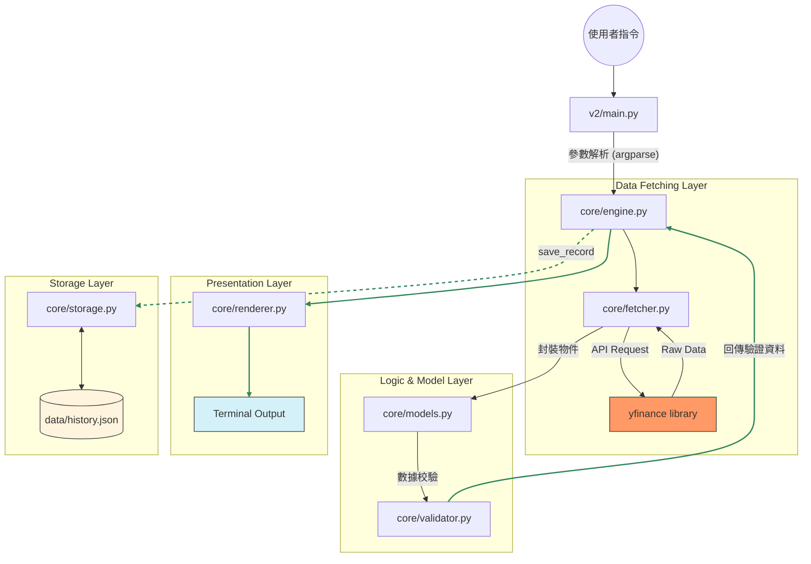
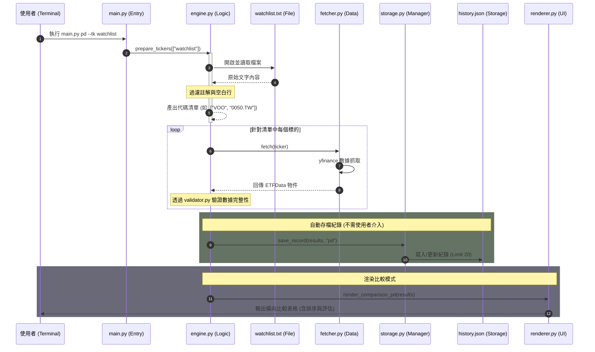

# ETF-Master v2.0 (Lite) 軟體設計文件 (SDD)

## 1. 專案概覽 (Project Overview)

- **程式名稱**：`etf-master`
- **版本**：v2.0
- **一句話描述**：跨市場 ETF 折溢價分析與基本面數據抓取工具。
- **核心價值**：統一台股 (.TW) 與美股 ETF 的數據存取介面，提供標準化的 CLI 診斷報告
- **2.0版本更新** 
- 1｜強化折溢價比較模式（修改既有 pd 模組）
- 2｜實作配息查詢指令（div）（全新功能!!）
- 3｜查詢結果本地快取與歷史回顧（全新功能!!）
- 4｜Watchlist 模式正式化（修改既有 prepare_tickers 邏輯）


---

## 2. CLI 介面規格 (Interface Specification)

### 指令規格
**執行方式：`python3 main.py <command> --tk <ticker>`**

| 指令 | 參數 | 說明 | 範例 |
| :--- | :--- | :--- | :--- |
| `info` | `--tk TEXT` | **基本資訊**：抓取並顯示 ETF 名稱、即時市價、幣別與更新時間。          | `python3 main.py info --tk 0050.TW` |
| `pd`   | `--tk TEXT` | **折溢價分析**：計算市價與官方淨值 (NAV) 的偏離百分比，並提供買入建議。 | `python3 main.py pd --tk VOO`      |
| `vol`  | `--tk TEXT `| **流動性分析**: 當日流動性與過往10日之比較|`python3 main.py vol --tk 0056.TW`|
| `div`  | `--tk TEXT` | **配息查詢**:查詢ETF過往配息資訊 | `python3 main.py div --tk 0056.TW`|
| `history`| `--tk TEXT` | **歷史紀錄**：查詢特定標的在本地 `history.json` 中的過往查詢快照。 | `python3 main.py history --tk VOO` |


---

根據您提供的 `v2/core/models.py` 原始碼內容，`ETFData` 類別中除了您列出的基本欄位外，還包含殖利率、成交量相關指標以及持股清單。

以下是為您整理完整且對齊原始碼實作的 **3. 資料模型 (Data Model)** 章節：

## 3. 資料模型 (Data Model)

### 3.1 ETF Data (核心模型)
位於 `core/models.py`，負責統一 API 回傳之原始數據。本模型採用 `dataclasses` 實作，確保數據結構的一致性。

| 欄位 | 型別 | 說明 | 必填 |
| :--- | :--- | :--- | :--- |
| `ticker` | `str` | 標的代碼 (自動轉為大寫) | ✅ |
| `name` | `str` | 基金完整名稱 (Long Name) | ✅ |
| `price` | `float` | 即時市價 (由多重欄位校驗取得) | ✅ |
| `currency` | `str` | 交易幣別 (TWD/USD) | ✅ |
| `tr_annual_yield` | `float` | 過去一年殖利率 (%) | ❌ |
| `nav` | `float` | 官方淨值 (Net Asset Value) | ✅ (僅 `pd`) |
| `latest_volume` | `float` | 當日/最新成交股數 | ✅ (僅 `vol`) |
| `avg_volume_10d` | `float` | 過去 10 個交易日平均成交量 | ✅ (僅 `vol`) |
| `top_holdings` | `List[Holding]` | 前幾大持股清單與權重 | ❌ |
| `last_updated` | `str` | 資料擷取時間 (YYYY-MM-DD HH:MM:SS) | ✅ |

### 計算屬性 (Properties)
模型內建自動計算邏輯，將原始數據轉化為投資決策指標：

* **`premium_discount` (float)**: 計算折溢價率。公式為 `((市價 - 淨值) / 淨值) * 100`。
* **`volume_ratio` (float)**: 計算成交量動能倍率。公式為 `今日成交量 / 10日平均量`。若數據缺失或平均量為 0，則回傳 `0.0`。

### 3.2 持久化模型 (Persistence Model - JSON)
位於 `v2/data/history.json`，用於儲存標的的歷史查詢紀錄。系統採「一標的多紀錄」結構，並由 `HistoryManager` 限制每檔標的最多保留最近 20 筆紀錄。

#### JSON 結構規格
```json
{
    "TICKER": [
        {
            "timestamp": "YYYY-MM-DD HH:MM",
            "type": "指令類型 (info/pd/vol/div)",
            "price": "浮點數 (當前市價)",
            "pd_rate": "浮點數 (折溢價%) 或 null",
            "vol_ratio": "浮點數 (量能比) 或 null",
            "yield": "浮點數 (殖利率/配息金額) 或 null"
        }
    ]
}
```

#### 儲存欄位說明
| JSON 欄位 | 型別 | 來源屬性 / 說明 |
| :--- | :--- | :--- |
| `timestamp` | `str` | 執行查詢時的本地時間 (`YYYY-MM-DD HH:MM`) |
| `type` | `str` | 觸發紀錄的指令名稱 (`info`, `pd`, `vol`, `div`) |
| `price` | `float` | 執行當時的市場價格 (`ETFData.price`) |
| `pd_rate` | `float?` | 計算後的折溢價百分比 (`ETFData.premium_discount`) |
| `vol_ratio` | `float?` | 計算後的成交量動能倍率 (`ETFData.volume_ratio`) |
| `yield` | `float?` | 過去一年殖利率或最近一次配息金額 (`ETFData.tr_annual_yield`) |

---

## 4. 系統架構圖（Architecture Diagram）

---

## 5. 核心功能流程圖（Sequence / Flowchart）


---


## 6. 錯誤處理規格 (Error Handling)

針對 CLI 工具之穩健性，系統實作了以下錯誤攔截與回饋機制，確保在數據異常或操作錯誤時能給予明確提示：

| 情境 | 輸出訊息 (Stdout) | 退出碼 (Exit Code) | 備註 |
| :--- | :--- | :--- | :--- |
| **無效 Ticker** | `❌ 標的 [TICKER] 分析失敗: 找不到標的 'TICKER'，或該時段無交易價格...` | 1 | 由 `Fetcher` 擷取不到歷史價格或 `yfinance` 回傳 404 時觸發。 |
| **淨值數據缺失** | `❌ 標的 [TICKER] 分析失敗: 標的 [TICKER] 目前無法抓取官方淨值 (NAV)，計算終止。` | 1 | 執行 `pd` 指令時，`DataValidator` 偵測到 `nav` 為空或非正數時觸發。 |
| **成交量數據異常** | `❌ 標的 [TICKER] 分析失敗: 標的 [TICKER] 無法獲取完整的成交量數據。` | 1 | 執行 `vol` 指令時，若平均成交量無法獲取或為 0 時由校驗模組攔截。 |
| **核心模組遺失** | `❌ 系統啟動失敗: 找不到核心模組 (ImportError)` | 1 | 程式啟動時若無法正確導入 `core.engine` 模組時觸發。 |
| **觀察清單缺失** | `⚠️ 錯誤: 找不到觀察列表檔案 [watchlist.txt]，請確認檔案是否存在。` | 0 (跳過) | 使用 `watchlist` 模式但目錄下無該檔案時，會跳過檔案讀取並提示使用者。 |
| **使用者中斷** | `使用者中斷程式執行。` | 0 | 使用者按下 `Ctrl+C` (KeyboardInterrupt) 時優雅退出。 |
| **參數輸入錯誤** | `usage: main.py [-h] {info,pd,vol,div,history} ...` | 2 | 由 `argparse` 內建機制處理，當未提供必要參數或指令錯誤時觸發。 |
| **歷史紀錄檔損壞**| `(無訊息，正常執行) `| 0 | storage.py 攔截 JSONDecodeError 後回傳空字典，並於下次存檔時自動覆蓋修復。|
---

### 錯誤處理實作說明：
1.  **分層攔截**：底層 `Fetcher` 負責攔截 API 數據存取錯誤，中層 `Validator` 負責商務邏輯校驗（如 `pd` 指令必須有淨值），最外層 `Engine` 則負責將異常轉化為使用者可讀的文字訊息。
2.  **非破壞性執行**：在批次處理（如 `watchlist` 模式）時，單一標的的失敗會顯示 `❌` 錯誤訊息但不會中斷整個程式，確保其餘標的能繼續完成分析。
---

## 7. 測試案例 (Test Cases)

本章節列出核心功能的驗證案例，確保指令解析、數據抓取、邏輯驗證與渲染模式切換符合設計預期。

| # | 輸入指令 | 預期輸出 | 通過條件 |
| :--- | :--- | :--- | :--- |
| 1 | `python3 main.py info --tk 0050.TW` | 顯示「元大台灣50」的基本面掃描資訊，包含市價與更新時間。 | stdout 包含 "0050" 且退出碼為 0。 |
| 2 | `python3 main.py pd --tk VOO` | 顯示 VOO 的單一標的折溢價分析報告。 | stdout 包含 "%"、"官方淨值" 且退出碼為 0。 |
| 3 | `python3 main.py pd --tk NO_SUCH_ETF` | 顯示紅叉錯誤訊息，說明找不到標的。 | stdout 包含 "分析失敗" 且退出碼為 1。 |
| 4 | `python3 main.py div --tk 0056.TW` | 顯示 0056 最近 5 筆配息紀錄與配息頻率觀測。 | stdout 包含 "除息日期" 與 "配息金額" 且退出碼為 0。 |
| 5 | `python3 main.py pd --tk watchlist` | 自動讀取 `watchlist.txt`，並以「橫向比較模式」顯示清單內所有標的之折溢價。 | stdout 包含 "折溢價橫向比較模式" 且成功讀取檔案內容。 |
| 6 | `python3 main.py vol --tk 0050.TW VOO` | 進入「量能噴發比較模式」，顯示多標的今日量、10日均量與量能比，並按動能排序。 | stdout 包含 "量能比"、"動能診斷" 且退出碼為 0。 |
| 7 | `python3 main.py history --tk VOO` | 顯示 VOO 存在 `history.json` 中的過往查詢歷史紀錄。 | stdout 包含 "標的歷史檔案" 與過往時間戳記。 |
| 8 | `python3 main.py` (不帶指令) | 顯示 argparse 自動產生的 usage 說明與可用指令清單。 | stdout 包含 "usage: main.py" 且退出碼為 0。 |

---

### 測試說明：
1.  **自動化持久化驗證**：在執行案例 1、2、4、6 之後，應檢查 `data/history.json` 是否已自動新增對應標的的紀錄。
2.  **邊界情況**：案例 5 測試了 `watchlist.txt` 的解析能力，包含對 `#` 註解行與空白行的過濾邏輯。
3.  **渲染分流**：案例 6 驗證了當 `--tk` 參數後方接續多個標位時，`engine.py` 是否能正確識別並呼叫 `renderer.py` 中的比較模式方法。
---

## 8. 向下相容性設計（Backward Compatibility）

### 8.1 保留的 v1.0 介面
本版本透過 `argparse` 的彈性配置，確保了舊有指令格式的完整支援。

| v1.0 指令範例 | v2.0 實際行為 | 是否相容 |
| :--- | :--- | :--- |
| `python3 main.py info --tk 0050.TW` | 呼叫 `run_info` 並顯示單一標的基本面掃描。 | ✅ 完全相容 |
| `python3 main.py pd --tk VOO` | 呼叫 `run_pd` 並渲染 `render_single_pd` 垂直報告。 | ✅ 完全相容 |
| `python3 main.py vol --tk 0056.TW` | 呼叫 `run_vol` 並渲染 `render_single_vol` 垂直報告。 | ✅ 完全相容 |
| `python3 main.py info --tk VOO 0050.TW` | 依序迴圈執行並顯示多個標的的獨立基本面資訊。 | ✅ 完全相容 |
| `python3 main.py pd --tk VOO 0050.TW` | 自動識別多標的，切換為 `render_comparison_pd` 橫向表格。 | ✅ 完全相容 |
| `python3 main.py vol --tk VOO 0050.TW` | 自動識別多標的，切換為 `render_comparison_vol` 橫向表格。 | ✅ 完全相容 |

### 8.2 破壞性變更（Breaking Changes）
* **無破壞性變更**：v2.0 採增量更新模式。
* **參數名稱一致性**：雖然核心結構更動，但 CLI 參數 `--tk` 完美承接了舊版輸入邏輯，且支援 `watchlist` 關鍵字自動讀取。
* **環境依賴更新**：本版本要求 `yfinance>=0.2.0` 以支援更穩定的數據抓取。

### 8.3 遷移策略（Migration Strategy）
* **自動初始化**：系統啟動時若偵測不到 `data/history.json`，`HistoryManager` 會自動建立目錄與空檔案，使用者無需手動遷移。
* **觀察清單沿用**：使用者只需將原有的 `watchlist.txt` 放置於 `v2/` 根目錄，`ETFEngine` 即可直接讀取並過濾 `#` 註解與空白行。
* **數據持久化**：v1.0 若有既有的執行結果，建議透過新指令重新執行一次以產生 `v2` 標準化的 `history.json` 快照資料。

---